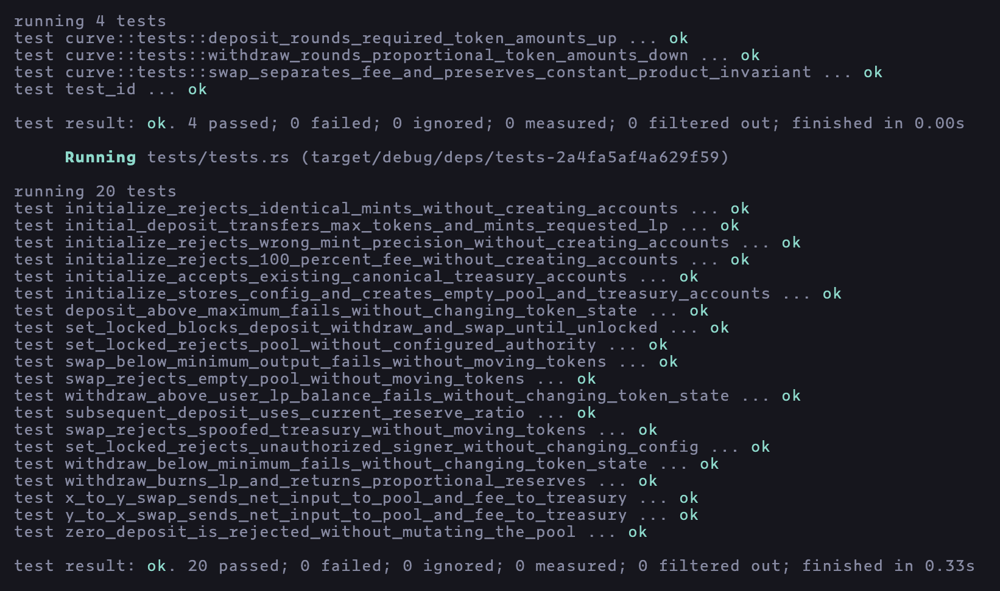

# Solana Constant-Product AMM

An Anchor program for permissionless token liquidity pools and constant-product swaps on Solana.

## Overview

This project implements the complete AMM lifecycle:

- Initialize a pool for two six-decimal SPL tokens
- Deposit tokens in the current pool ratio and receive LP tokens
- Burn LP tokens to withdraw a proportional share of both reserves
- Swap in either direction using a custom constant-product curve
- Route swap fees to canonical treasury token accounts
- Lock and unlock pool mutations through an optional authority

## Design

Each pool uses a configuration PDA and an LP mint PDA:

```text
["config", seed]
["lp", config public key]
```

| Account      | Authority  | Purpose                                                       |
| ------------ | ---------- | ------------------------------------------------------------- |
| `config`     | Program    | Stores pool mints, fee, treasury, lock state, seed, and bumps |
| `mint_lp`    | Config PDA | Issues fungible shares representing pool ownership            |
| `vault_x`    | Config PDA | Holds the pool reserve of token X                             |
| `vault_y`    | Config PDA | Holds the pool reserve of token Y                             |
| `treasury_x` | Treasury   | Receives protocol fees paid in token X                        |
| `treasury_y` | Treasury   | Receives protocol fees paid in token Y                        |
| `user_x`     | User       | Supplies or receives token X                                  |
| `user_y`     | User       | Supplies or receives token Y                                  |
| `user_lp`    | User       | Holds the user's proportional pool shares                     |

The vault and treasury token accounts are canonical associated token accounts. Existing canonical treasury accounts can be reused when pools share a treasury or token mint.

### Liquidity accounting

The first liquidity provider chooses the initial token reserves and requested LP supply. Later deposits must follow the existing reserve ratio. For a requested LP amount `l`, the required deposits are:

```text
x = ceil(reserve_x * l / lp_supply)
y = ceil(reserve_y * l / lp_supply)
```

Rounding deposits upward prevents a provider from receiving more pool ownership than the tokens supplied.

When LP tokens are burned, withdrawals are calculated as:

```text
x = floor(reserve_x * l / lp_supply)
y = floor(reserve_y * l / lp_supply)
```

Rounding withdrawals downward prevents a user from withdrawing more than their proportional ownership.

### Swap pricing and fees

The fee is configured in bps.

```text
net_input = floor(gross_input * (10_000 - fee_bps) / 10_000)
fee       = gross_input - net_input
output    = floor(reserve_out * net_input / (reserve_in + net_input))
```

The pool receives `net_input`, the treasury receives `fee`, and the user receives `output`.

### Pool locking

Pools may be initialized with an optional authority. That authority can use `set_locked` to pause or resume deposits, withdrawals, and swaps. Initialization and lock-state changes remain available while locked.

Pools initialized without an authority cannot later change their lock state.

## Instructions

| Instruction  | Purpose                                                                  |
| ------------ | ------------------------------------------------------------------------ |
| `initialize` | Create the configuration, LP mint, reserve vaults, and treasury accounts |
| `deposit`    | Deposit proportional reserves and mint the requested LP amount           |
| `withdraw`   | Burn LP tokens and return the proportional token reserves                |
| `swap`       | Exchange token X for Y or Y for X and route the fee to the treasury      |
| `set_locked` | Lock or unlock deposits, withdrawals, and swaps                          |

## Token flows

### Deposit

```text
user_x -- token X --> vault_x
user_y -- token Y --> vault_y
mint_lp -- LP tokens --> user_lp
```

### Withdraw

```text
user_lp -- burn --> mint_lp
vault_x -- token X --> user_x
vault_y -- token Y --> user_y
```

### Swap X for Y

```text
user_x -- net token X --> vault_x
user_x -- token X fee --> treasury_x
vault_y -- token Y output --> user_y
```

Y-for-X vice versa.

## Downtime mitigation

The AMM calculates prices entirely on-chain from its vault balances, so swaps do not depend on an oracles or off-chain pricing service. Emergency locks are available. This removes several common sources of DeFi downtime, but infra can still fail.

Production should counter these risks with:

- Multiple RPC providers with health checks and failover
- Redundant frontends plus CLI for direct interaction
- Monitoring
- multisig lock authority
- multisig upgrade authority

## Setup

Install Rust, Solana, Anchor, Node.js, and pnpm, then:

```bash
pnpm install
```

## Testing

Run all tests:

```bash
pnpm test
```

The tests cover:

- Configuration, PDA bumps, LP mint authority, vaults, and treasury accounts
- Invalid fees, token precision, and identical token mints
- Initial and proportional deposits with exact token and LP accounting
- Proportional withdrawals and LP burning
- Local rounding behavior for deposits and withdrawals
- X-to-Y and Y-to-X swaps
- Constant-product invariants
- Slippage failures, empty pools, insufficient LP balances, and transaction atomicity
- Authorized locking and unlocking, unauthorized changes, and authority-free pools



## Submission

### Task status

- [x] Implement the AMM program
- [x] Add swap fees and treasury accounts
- [x] Add LiteSVM coverage for all instructions
- [x] Implement the optional constant-product curve locally
- [x] Document downtime mitigation considerations
- [x] Capture the final passing-test screenshot
